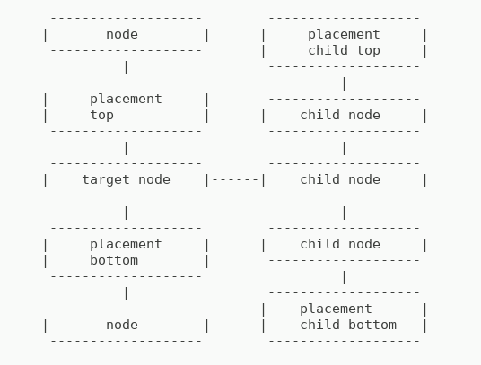

# Tree


[](https://packagist.org/packages/stefano/stefano-tree)
[](https://app.travis-ci.com/bartko-s/stefano-tree) 
[](https://coveralls.io/github/bartko-s/stefano-tree?branch=master)
[](https://scrutinizer-ci.com/g/bartko-s/stefano-tree/?branch=master) 
[](https://packagist.org/packages/stefano/stefano-tree)
[](https://packagist.org/packages/stefano/stefano-tree)
[](https://packagist.org/packages/stefano/stefano-tree)

[](https://www.buymeacoffee.com/bartko)

[](https://paypal.me/stevo4)

[Nested Set](https://en.wikipedia.org/wiki/Nested_set_model) implementation for PHP.

[](https://www.tree.stefanbartko.sk)

## Features

 - NestedSet(MPTT - Modified Pre-order Tree Traversal)
 - Support scopes (multiple independent tree in one db table)
 - Rebuild broken tree
 - Tested with MySQL/MariaDB and PostgreSQL but should work with any database vendor which support transaction
 - Supported [PDO](http://php.net/manual/en/intro.pdo.php), [Zend Framework 1](https://framework.zend.com/manual/1.12/en/zend.db.html), [Laminas Db](https://github.com/laminas/laminas-db), [Doctrine 2 DBAL and Doctrine 3 DBAL](http://docs.doctrine-project.org/projects/doctrine-dbal/en/latest/). It is easy to implement support for any framework
 - Support nested transaction
 - PHP 7 and PHP 8 support

## Dependencies
- This library has no external dependencies. Can work with pure PHP.

## Installation

Run following command in terminal
```
composer require stefano/stefano-tree
```

## Create Tree Adapter

|        key         |  type  | required | default value | note                                                  |
| :----------------- | :----: | :------: | :------------ | :---------------------------------------------------- |
| tableName          | string | yes      |               |                                                       |
| idColumnName       | string | yes      |               |                                                       |
| leftColumnName     | string | no       | lft           |                                                       |
| rightColumnName    | string | no       | rgt           |                                                       |
| levelColumnName    | string | no       | level         |                                                       |
| parentIdColumnName | string | no       | parent_id     |                                                       |
| sequenceName       | string | see note |               | Required for PostgreSQL                               |
| scopeColumnName    | string | see note |               | If empty scope support is disabled                    |
| dbSelectBuilder    | callable | no     |               | see Join table example below                          |


```
use \StefanoTree\NestedSet;

$options = array(
    'tableName'    => 'tree_traversal',
    'idColumnName' => 'tree_traversal_id',
    // other options
);

$dbAdapter = pure \PDO, Zend1 Db Adapter, Laminas Db Adapter, Doctrine DBAL Connection or any class which implements StefanoTree\NestedSet\Adapter\AdapterInterface interface 

$tree = new NestedSet($options, $dbAdapter);
```

- You can join table.

```
$options = array(
    'tableName'       => 'tree_traversal',
    'idColumnName'    => 'tree_traversal_id',
    'dbSelectBuilder' => function() {
         // You can use any "callable" like function or object
         // Select must be without where or order part
         return 'SELECT tree_traversal.*, m.something, ...'
           .' FROM tree_traversal'
           .' LEFT JOIN metadata AS m ON tree_traversal.id=m.tree_id';
     }, 
    // other options
);

$tree = new NestedSet($options, $dbAdapter);
```

## API

### Creating nodes

- Create root node

```
use StefanoTree\Exception\ValidationException;

try {
    $data = array(
        // values
        // id_column_name => uuid 
    );
    
    // create root node.
    $rootNodeId = $tree->createRootNode($data);
    
    // create root node. Second param "$scope" is required only if scope support is enabled.
    $rootNodeId = $tree->createRootNode($data, $scope);    
} catch (ValidationException $e) {
    $errorMessage = $e->getMessage();
}    
```

- Create new node. You can create new node at 4 different locations.



```
use StefanoTree\Exception\ValidationException;

try {
    $targetNodeId = 10;
    
    $data = array(
        // values
        // id_column_name => uuid 
    );

    $nodeId = $tree->addNode($targetNodeId, $data, $tree::PLACEMENT_CHILD_TOP);
    $nodeId = $tree->addNode($targetNodeId, $data, $tree::PLACEMENT_CHILD_BOTTOM);
    $nodeId = $tree->addNode($targetNodeId, $data, $tree::PLACEMENT_TOP);
    $nodeId = $tree->addNode($targetNodeId, $data, $tree::PLACEMENT_BOTTOM);
} catch (ValidationException $e) {
    $errorMessage = $e->getMessage();
}    
```

### Update Node

```
use StefanoTree\Exception\ValidationException;

try {
    $targetNodeId = 10;
    
    $data = array(
        // values
    );
    
    $tree->updateNode($targetNodeId, $data);
} catch (ValidationException $e) {
    $errorMessage = $e->getMessage();
}    
```

### Move node

- You can move node at 4 different locations.


```
use StefanoTree\Exception\ValidationException;

try {
    $sourceNodeId = 15;
    $targetNodeId = 10;
    
    $tree->moveNode($sourceNodeId, $targetNodeId, $tree::PLACEMENT_CHILD_TOP);
    $tree->moveNode($sourceNodeId, $targetNodeId, $tree::PLACEMENT_CHILD_BOTTOM);
    $tree->moveNode($sourceNodeId, $targetNodeId, $tree::PLACEMENT_TOP);
    $tree->moveNode($sourceNodeId, $targetNodeId, $tree::PLACEMENT_BOTTOM);
} catch (ValidationException $e) {
    $errorMessage = $e->getMessage();
}        
```

### Delete node or branch

```
use StefanoTree\Exception\ValidationException;

try {
    $nodeId = 15;
    
    $tree->deleteBranch($nodeId);
} catch (ValidationException $e) {
    $errorMessage = $e->getMessage();
}    
```

### Getting nodes

- Get descendants

```
$nodeId = 15;

// all descendants
$tree->getDescendantsQueryBuilder()
     ->get($nodeId);
     
// all descendants result as nested array
$tree->getDescendantsQueryBuilder()
     ->get($nodeId, true);
     
// only children     
$tree->getDescendantsQueryBuilder()
     ->excludeFirstNLevel(1)
     ->levelLimit(1)
     ->get($nodeId);

// exclude first level($nodeId) from result
$tree->getDescendants()
     ->excludeFirstNLevel(1)
     ->get($nodeId);

// exclude first two levels from result
$tree->getDescendantsQueryBuilder()
     ->excludeFirstNLevel(2)
     ->get($nodeId);

// return first 4 level
$tree->getDescendantsQueryBuilder()
     ->levelLimit(4)
     ->get($nodeId);

// exclude branch from  result
$tree->getDescendantsQueryBuilder()
     ->excludeBranch(22)
     ->get($nodeId);
```

- Get Ancestors

```
$nodeId = 15;

// get all
$tree->getAncestorsQueryBuilder()
     ->get($nodeId);
     
// get all as nested array
$tree->getAncestorsQueryBuilder()
     ->get($nodeId, true);

// exclude last node($nodeId) from result
$tree->getAncestorsQueryBuilder()
     ->excludeLastNLevel(1)
     ->get($nodeId);

// exclude first two levels from result
$tree->getAncestorsQueryBuilder()
     ->excludeFirstNLevel(2)
     ->get($nodeId);
```

### Validation and Rebuild broken tree

- Check if tree is valid

```
use StefanoTree\Exception\ValidationException;

try {
    $satus = $tree->isValid($rootNodeId);
} catch (ValidationException $e) {
    $errorMessage = $e->getMessage();
}
```

- Rebuild broken tree

```
use StefanoTree\Exception\ValidationException;

try {
    $tree->rebuild($rootNodeId);
} catch (ValidationException $e) {
    $errorMessage = $e->getMessage();
}
```

## Contributing

Any contributions are welcome. If you find any issue don't hesitate to open a new issue or send a pull request.

[](https://www.buymeacoffee.com/bartko)